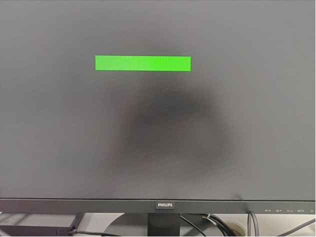
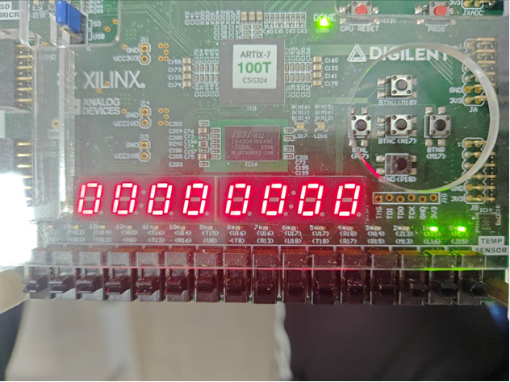
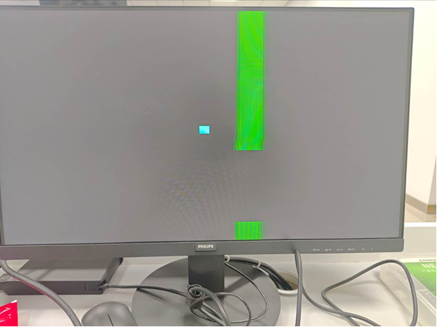
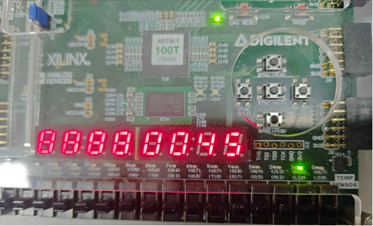
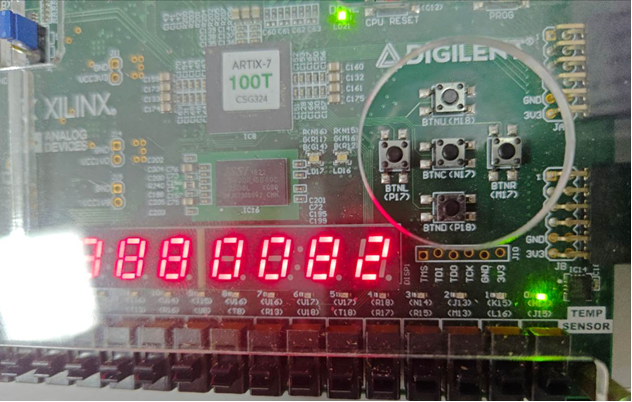
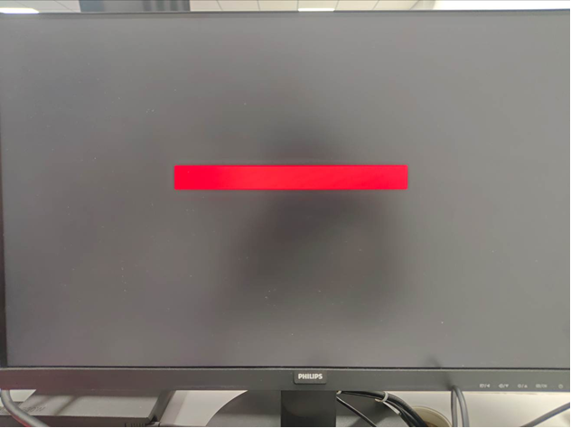
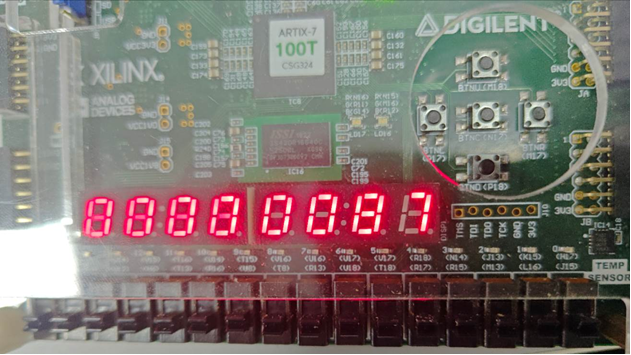

**注：该文档借助ai生成，可能存在不准确或不完整的描述，请以实际代码和项目文件为准。**

# 基于 Artix-7 的管道躲避游戏（类似 Flappy Bird）

这个工程是大二上学期数字逻辑课程设计的成果：在 Nexys DDR（Artix-7，Xilinx XC7A100T-1CSG324C）FPGA 开发板上实现的一个类似 Flappy Bird 的动作躲避游戏。

**演示与玩法概述**
- 初始时，玩家控制的物体出现在屏幕中心，可以向上/下/左/右自由移动。
- 绿色管道从屏幕右侧不断生成并向左移动，随着时间推移移动速度会加快。
- 玩家有有限的三条命（life），在板卡上的 LED 指示（用户实现为 LED 位置 11,10.01.00）。
- 分数会随时间增加并显示在七段数码管上。

**主要特性**
- 四向控制：使用板卡上的按键 `BTNU` (上)、`BTND` (下)、`BTNL` (左)、`BTNR` (右)。
- 复位：使用 `BTNC` 作为复位按键。
- 管道生成与碰撞检测由硬件逻辑实现（Verilog）。
- 适配 Nexys DDR 开发板：输出到 VGA / 七段数码管 / LED。

**硬件平台**
- 板卡型号：Nexys DDR
- FPGA：Xilinx Artix-7 XC7A100T-1CSG324C

**仓库 / 代码结构（重要文件）**
- 项目工程：[car.xpr](car.xpr)
- 顶层模块：[car.srcs/sources_1/new/top.v](car.srcs/sources_1/new/top.v)
- 游戏逻辑与模块（示例）：
  - [car.srcs/sources_1/new/game_fsm.v](car.srcs/sources_1/new/game_fsm.v)
  - [car.srcs/sources_1/new/renderer.v](car.srcs/sources_1/new/renderer.v)
  - [car.srcs/sources_1/new/game_data.v](car.srcs/sources_1/new/game_data.v)
  - [car.srcs/sources_1/new/obstacle.v](car.srcs/sources_1/new/obstacle.v)
  - [car.srcs/sources_1/new/pipe_obstacle.v](car.srcs/sources_1/new/pipe_obstacle.v)
  - [car.srcs/sources_1/new/sevenseg.v](car.srcs/sources_1/new/sevenseg.v)

（以上为仓库内的关键源码文件，更多模块位于 `car.srcs/sources_1/new/` 目录）

**构建与烧写**
1. 在运行 Vivado 的电脑上打开 `car.xpr` 项目（File → Open Project → 选择 `car.xpr`）。
2. 在 Vivado 中运行 Synthesis → Implementation → Generate Bitstream。
3. 打开 Hardware Manager，连接开发板并使用 Program Device 将生成的 bitstream 烧写到板卡。

注：不同版本的 Vivado 菜单或流程可能略有差异，请以你所用 Vivado 版本为准。

**如何游玩**
- 按键 `BTNU`：物体向上移动
- 按键 `BTND`：物体向下移动
- 按键 `BTNL`：物体向左移动
- 按键 `BTNR`：物体向右移动
- 按键 `BTNC`：复位/重新开始
- 生命显示：板卡 LED（实现为 LED 索引或布局：11,10,01,00）
- 分数显示：七段数码管

**演示（截图说明）**

下面按演示流程给出说明，并附上对应的截图（见 `docs/images/` 目录的图片）：

- 系统上电与待机界面显示（见图 1、2）
  - 系统上电或复位后，连接显示器，屏幕进入待机（IDLE）状态，用一个绿色矩形条表示（图 1、2）。

- 游戏运行过程展示（见图 3）
  - 按下开始按钮后，系统进入游戏运行（PLAY）状态。小车根据板卡的四个按钮输入在屏幕中上下左右移动；管道障碍物从屏幕右侧向左移动，随时间加速，难度逐步增大。数码管实时显示当前分数，板卡右侧的两个 LED 显示当前生命值。（图 3）

- 生命值为 2 和 1 的状态（见图 4、5）
  - 当发生碰撞导致生命值减少时，数码管与 LED 会相应更新，图 4、5 分别展示生命值为 2 与 1 时的显示状态。

- 碰撞检测与游戏结束界面（见图 6、7）
  - 当小车与障碍物碰撞时，生命值减一；当生命值从 3 减为 0 时，游戏状态从 `PLAY` 切换至 `OVER`。此时小车与障碍物停止运动，屏幕显示一个红色矩形条作为游戏结束提示，得分保持不变，系统等待复位或重新开始（图 6、7）。

图像文件：

- 待机界面（绿色矩形条）
- 板卡与七段数码管全景（待机时数码管显示 0）
- PLAY 状态（小车与上下管道）
- 生命值为 2 的数码管显示示例
- 生命值为 1 的数码管显示示例
- 游戏结束界面（红色矩形条，得分保持）
- 数码管/按键面板特写

